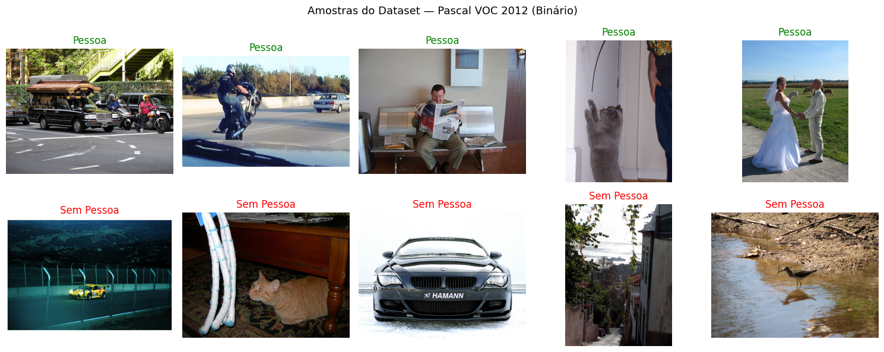
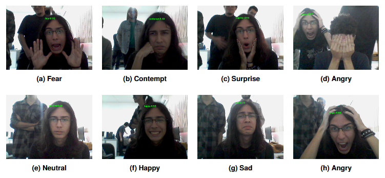
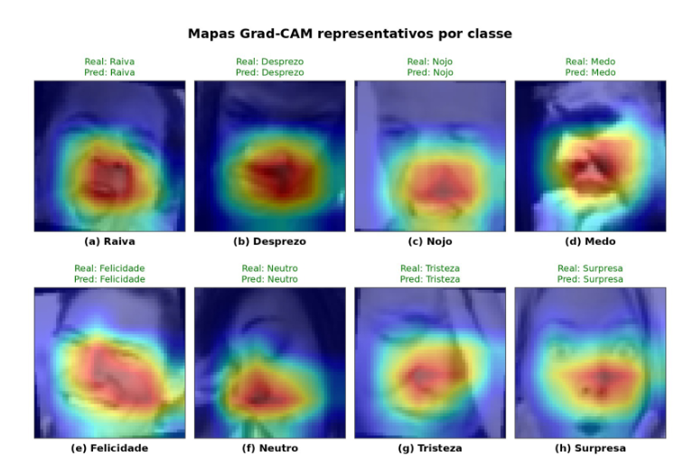

# Projeto de Visão Computacional

Este repositório reúne duas etapas de um projeto desenvolvido na disciplina de **Visão Computacional** da **Universidade Federal do Maranhão (UFMA)**.

A primeira fase trabalha com uma tarefa binária de reconhecimento de pessoas em imagens. A segunda avança para o reconhecimento de expressões faciais, incluindo busca de arquitetura, avaliação em outro dataset, explicabilidade e uma aplicação em tempo real.

## Etapas do projeto

| Fase | Problema | Dataset principal | Saída |
|---|---|---|---|
| **Fase 1** | Identificar se existe ou não uma pessoa na imagem | Pascal VOC 2012 | `Pessoa` ou `Sem Pessoa` |
| **Fase 2** | Reconhecer a expressão facial de cada pessoa detectada | FER+ | Uma entre 8 classes de emoção |

---

# Fase 1 — Reconhecimento de pessoas em imagens

A primeira etapa foi formulada como um problema de **classificação binária**. A partir das anotações do **Pascal VOC 2012**, as imagens foram reorganizadas em duas categorias:

- **Pessoa:** existe pelo menos uma pessoa na imagem;
- **Sem Pessoa:** nenhuma pessoa está presente.

Essa simplificação permitiu trabalhar primeiro com uma pergunta objetiva: *a imagem contém uma pessoa?* Antes de avançar para localização facial e reconhecimento de expressões, essa fase serviu para estudar o pipeline completo de classificação, avaliação e análise visual das decisões do modelo.

## Amostras do Pascal VOC 2012

A figura abaixo mostra exemplos utilizados na tarefa binária. As imagens positivas podem conter uma ou várias pessoas, inclusive parcialmente visíveis. Já a classe negativa reúne cenários variados, como animais, veículos, paisagens e objetos.

<p align="center">
  
</p>

## Explicabilidade na Fase 1

Além das métricas de classificação, foram gerados mapas de ativação para observar quais regiões contribuíram para a decisão do modelo.

Nos exemplos classificados como **Pessoa**, a ativação costuma se concentrar na silhueta, no corpo ou na região ocupada pelas pessoas. Nos exemplos classificados como **Sem Pessoa**, o modelo tende a destacar os elementos mais salientes da cena, como animais, veículos, construções ou objetos.

Essa análise também ajuda a encontrar comportamentos indesejados. Em algumas imagens, o modelo pode associar a classe a elementos do cenário em vez de utilizar exclusivamente características humanas.

<p align="center">
  
</p>

## Fluxo da Fase 1

```text
Imagem do Pascal VOC 2012
            ↓
Conversão das anotações para rótulo binário
            ↓
Pré-processamento
            ↓
Treinamento do classificador
            ↓
Pessoa / Sem Pessoa
            ↓
Métricas e mapas de ativação
```

---

# Fase 2 — Reconhecimento de expressões faciais

Na segunda fase, o objetivo deixou de ser apenas reconhecer a presença de uma pessoa. O problema passou a ser identificar **qual expressão facial está sendo apresentada**.

O modelo foi treinado com o **FER+**, considerando oito classes:

- raiva;
- desprezo;
- nojo;
- medo;
- felicidade;
- neutralidade;
- tristeza;
- surpresa.

A arquitetura foi construída seguindo o espaço de projeto **AnyNet**. Em vez de definir uma rede completamente fixa, foram parametrizados o número de estágios, as larguras, as profundidades, o tipo de bloco, o dropout e a taxa de aprendizado.

## Arquitetura

A rede é organizada em três partes:

1. **Stem:** primeira extração de características;
2. **Estágios convolucionais:** sequência de blocos com larguras e profundidades variáveis;
3. **Head:** agregação das características e classificação final.

Durante a busca foram considerados dois tipos de bloco:

### PlainConv

Bloco residual simples com convolução `3 × 3`, normalização em lote, ReLU e uma projeção `1 × 1` no atalho quando as dimensões mudam.

### MBConv

Bloco inspirado no MobileNetV2 e no EfficientNet, composto por expansão de canais, convolução *depthwise*, mecanismo Squeeze-and-Excitation e projeção final.

Mesmo com a presença do MBConv no espaço de busca, os melhores resultados foram obtidos por configurações formadas apenas por blocos **PlainConv**.

## Busca de arquitetura com Optuna

A busca foi conduzida com o **Optuna**, usando o sampler TPE.

Foram executados:

- 3 estudos independentes;
- 30 trials em cada estudo;
- 90 trials iniciais;
- mais 30 trials no estudo mais promissor;
- **120 trials no total**.

Cada configuração foi avaliada por validação cruzada estratificada com três folds, utilizando o **F1 macro** como métrica principal de seleção.

Os experimentos foram acompanhados pelo **Weights & Biases**, onde foram registradas as curvas de treino, as métricas por época e os hiperparâmetros de cada trial.

## Resultados no FER+

Dois modelos foram mantidos para comparação:

| Modelo | Accuracy média | F1 macro médio |
|---|---:|---:|
| Modelo A | 0,8927 ± 0,0021 | 0,8975 ± 0,0015 |
| Modelo D | 0,8958 ± 0,0040 | 0,9008 ± 0,0031 |

O Modelo D teve o maior F1 macro no FER+. Ainda assim, o Modelo A foi escolhido para a aplicação final por apresentar melhor generalização no CK+.

## Avaliação no CK+

O CK+ foi utilizado como um teste externo, sem participar da busca de arquitetura. O objetivo foi verificar como os modelos treinados no FER+ se comportariam diante de imagens produzidas em outro contexto.

| Modelo | Accuracy | F1 macro | F1 weighted |
|---|---:|---:|---:|
| Modelo A | 0,5525 | 0,4243 | 0,5880 |
| Modelo D | 0,5178 | 0,3888 | 0,5371 |

A queda de desempenho mostra que existe uma diferença importante entre os dois conjuntos. Ainda assim, o Modelo A manteve bons resultados em classes mais expressivas, especialmente felicidade e surpresa.

---

# Aplicação em tempo real

Para transformar o classificador em uma demonstração prática, foi desenvolvida uma aplicação com webcam.

A aplicação utiliza duas etapas separadas:

1. a **YOLOv11n-Face** detecta todos os rostos presentes no quadro;
2. o classificador AnyNet recebe cada recorte e estima a expressão facial.

O detector facial permanece fixo. A inferência de emoções é feita pelo checkpoint escolhido do classificador.

```text
Frame da webcam
       ↓
YOLOv11n-Face
       ↓
Detecção de todos os rostos
       ↓
Recorte individual de cada face
       ↓
Pré-processamento
       ↓
Classificador de emoções
       ↓
Classe, confiança e visualização
```

## Exemplos de inferência

A figura reúne exemplos obtidos diretamente com a aplicação. Durante esses testes, algumas classes mais expressivas foram reconhecidas com maior facilidade, enquanto nojo, desprezo e medo exigiram expressões mais marcadas.

<p align="center">
  
</p>

---

# Explicabilidade na Fase 2

O **Grad-CAM** foi aplicado na última camada convolucional do último estágio da rede.

Os mapas mostram que o classificador costuma concentrar a ativação principalmente em regiões como boca, bochechas e nariz. Dependendo da emoção, olhos e sobrancelhas também podem contribuir, embora tenham aparecido com menor destaque em vários exemplos.

<p align="center">
  
</p>

A visualização não serve apenas para apresentar acertos. Ela também ajuda a verificar se o modelo está olhando para regiões facialmente coerentes e a investigar confusões entre expressões visualmente semelhantes.

---

# Organização sugerida do repositório

```text
.
├── README.md
├── artigo/
│   ├── visaocomputacional.pdf
│   └── referencias.bib
│
├── fase_1_pessoa_sem_pessoa/
│   ├── notebooks/
│   ├── resultados/
│   └── README.md
│
├── fase_2_expressoes_faciais/
│   ├── notebooks/
│   │   ├── busca_anynet_optuna.ipynb
│   │   ├── treino_final_ferplus.ipynb
│   │   ├── inferencia_ckplus.ipynb
│   │   └── gradcam.ipynb
│   ├── scripts/
│   │   └── face_detection_yolonas_comp.py
│   ├── models/
│   │   ├── anynet_fold_multi_8.pth
│   │   └── yolov11n-face.pt
│   └── resultados/
│
├── assets/
│   └── images/
│       ├── amostras-pascal.png
│       ├── gradcam-fase-1.png
│       ├── acertos-modelo.png
│       └── mapas-de-ativacao-acertos.png
│
└── requirements.txt
```

---

# Como executar

## 1. Clonar o repositório

```bash
git clone <URL_DO_REPOSITORIO>
cd <NOME_DO_REPOSITORIO>
```

## 2. Criar um ambiente virtual

### Windows

```powershell
python -m venv .venv
.venv\Scripts\activate
```

### Linux ou macOS

```bash
python -m venv .venv
source .venv/bin/activate
```

## 3. Instalar as dependências

```bash
pip install -r requirements.txt
```

## 4. Executar os notebooks

```bash
jupyter notebook
```

## 5. Executar a aplicação em tempo real

```bash
python fase_2_expressoes_faciais/scripts/face_detection_yolonas_comp.py
```

Os arquivos `yolov11n-face.pt` e o checkpoint do classificador precisam estar no caminho esperado pelo script.

---

# Tecnologias utilizadas

- Python
- PyTorch
- Torchvision
- Optuna
- Ultralytics
- OpenCV
- Scikit-learn
- Matplotlib
- Weights & Biases
- Grad-CAM

---

# Limitações

Alguns pontos identificados durante os experimentos:

- as imagens do FER+ foram reduzidas para `48 × 48`, diminuindo a quantidade de detalhes disponíveis;
- houve uma queda significativa de desempenho na transferência do FER+ para o CK+;
- classes sutis, como desprezo e nojo, foram mais difíceis na aplicação em tempo real;
- os mapas de ativação indicaram forte dependência da região da boca;
- os testes com webcam foram qualitativos e ainda não incluem uma avaliação formal de FPS ou acurácia em ambiente real;
- na Fase 1, algumas ativações sugerem que o classificador pode utilizar pistas do cenário além das características das pessoas.

---

# Artigo

O artigo incluído no repositório detalha a segunda fase do projeto, incluindo:

- espaço de busca AnyNet;
- blocos PlainConv e MBConv;
- otimização com Optuna;
- resultados no FER+;
- generalização no CK+;
- aplicação com YOLOv11n-Face;
- análise com Grad-CAM.

---

# Autores

- **Caio Bandeira Moreira**
- **Davih Asaph Tavares Alves**
- **José Marques Viana Júnior**
- **Maurício Miranda Celani**

Disciplina de Visão Computacional  
Universidade Federal do Maranhão — UFMA

---

# Referências principais

As referências completas estão disponíveis no arquivo `.bib` do projeto. Entre os principais trabalhos utilizados estão:

- AnyNet / Designing Network Design Spaces;
- ResNet;
- MobileNetV2;
- EfficientNet;
- Squeeze-and-Excitation Networks;
- Optuna;
- FER+;
- CK+;
- YOLO;
- WIDER FACE;
- Grad-CAM;
- PyTorch;
- Scikit-learn.
